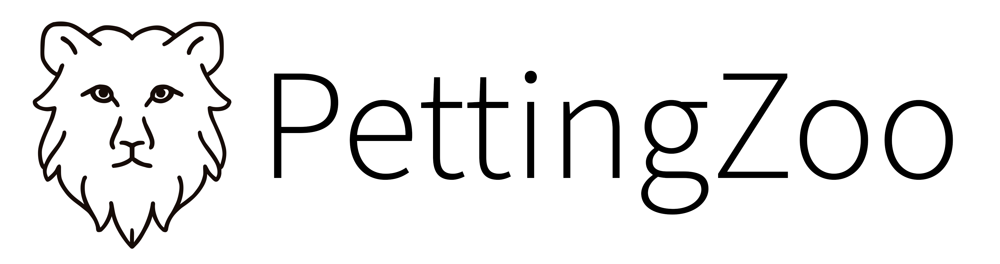

<p align="center">
    
</p>

[](https://github.com/PettingZoo-Team/PettingZoo/actions?query=workflow%3A%22Python+tests%22)

PettingZoo is a Python library for conducting research in multi-agent reinforcement learning. It's akin to a multi-agent version of OpenAI's Gym library.

Our website, with comprehensive documentation, is [pettingzoo.ml](https://www.pettingzoo.ml)

## Environments and Installation

PettingZoo includes the following families of environments:

* [Atari](https://www.pettingzoo.ml/atari): Multi-player Atari 2600 games (cooperative, competitive and mixed sum)
* [Butterfly](https://www.pettingzoo.ml/butterfly): Cooperative graphical games developed by us, requiring a high degree of coordination
* [Classic](https://www.pettingzoo.ml/classic): Classical games including card games, board games, etc.
* [MAgent](https://www.pettingzoo.ml/magent): Configurable environments with massive numbers of particle agents, originally from https://github.com/geek-ai/MAgent
* [MPE](https://www.pettingzoo.ml/mpe): A set of simple nongraphical communication tasks, originally from https://github.com/openai/multiagent-particle-envs
* [SISL](https://www.pettingzoo.ml/sisl): 3 cooperative environments, originally from https://github.com/sisl/MADRL

To install the pettingzoo base library, use `pip install pettingzoo`.

This does not include dependencies for all families of environments (there's a massive number, and some can be problematic to install on certain systems). You can install these dependencies for one family like `pip install pettingzoo[atari]` or use `pip install pettingzoo[all]` to install all dependencies.

We support Python 3.6, 3.7, 3.8 and 3.9 on Linux and macOS. We will accept PRs related to Windows, but do not officially support it.

## API

PettingZoo model environments as [*Agent Environment Cycle* (AEC) games](https://arxiv.org/abs/2009.13051), in order to be able to cleanly support all types of multi-agent RL environments under one API and to minimize the potential for certain classes of common bugs.

Using environments in PettingZoo is very similar to Gym, i.e. you initialize an environment via:

```
from pettingzoo.butterfly import pistonball_v4
env = pistonball_v4.env()
```

Environments can be interacted with in a manner very similar to Gym:

```
env.reset()
for agent in env.agent_iter():
    observation, reward, done, info = env.last()
    action = policy(observation)
    env.step(action)
```

For the complete API documentation, please see https://www.pettingzoo.ml/api

### Parallel API

In certain environments, it's a valid to assume that agents take their actions at the same time. For these games, we offer a secondary API to allow for parallel actions, documented at https://www.pettingzoo.ml/api#parallel-api

## SuperSuit

SuperSuit is a library that includes all commonly used wrappers in RL (frame stacking, observation, normalization, etc.) for PettingZoo and Gym environments with a nice API. We developed it in lieu of wrappers built into PettingZoo. https://github.com/PettingZoo-Team/SuperSuit

## Environment Versioning

PettingZoo keeps strict versioning for reproducibility reasons. All environments end in a suffix like "\_v0".  When changes are made to environments that might impact learning results, the number is increased by one to prevent potential confusion.

## Citation

To cite this project in publication, please use

```
@article{terry2020pettingzoo,
  Title = {PettingZoo: Gym for Multi-Agent Reinforcement Learning},
  Author = {Terry, Justin K and Black, Benjamin and Jayakumar, Mario and Hari, Ananth and Santos, Luis and Dieffendahl, Clemens and Williams, Niall L and Lokesh, Yashas and Sullivan, Ryan and Horsch, Caroline and Ravi, Praveen},
  journal={arXiv preprint arXiv:2009.14471},
  year={2020}
}
```
