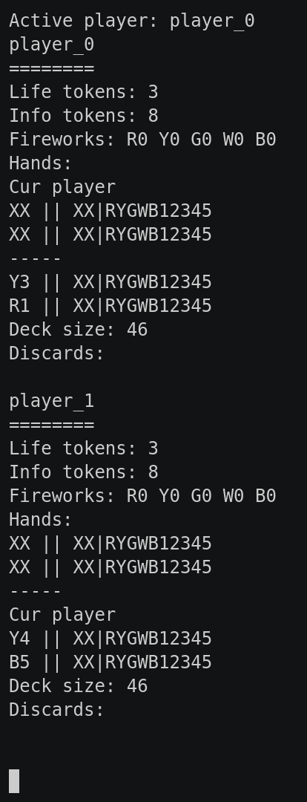

### Hanabi

This game part of the [classic games](../classic.md), please visit that page first for general information about these games.

| Actions  | Agents | Manual Control | Action Shape  | Action Values  | Observation Shape | Observation Values | Num States    |
|----------|--------|----------------|---------------|----------------|-------------------|--------------------|---------------|
| Discrete | 2      | No             | (1,)          | Discrete(14)   | (373,)            | [0,1]              |   ?           |

`from pettingzoo.classic import hanabi_v0`

`agents= ['player_0', 'player_0']`

*AEC Diagram*

Hanabi is a 2-5 player cooperative game where players work together to form fireworks of different colors. A firework is a set of cards of the same color, ordered from 1 to 5. Cards in the game have both a color and number; each player can view the cards another player holds, but not their own. Players cannot directly communicate with each other, but must instead remove an info token from play in order to give information. Players can tell other players which of the cards in their hand is a specific color, or a specific number. There are initially 8 info tokens, but players can discard cards in their hand to return an info token into play. Players can also play a card from their hand: the card must either begin a new firework or be appended in order to an existing firework. However, 2 fireworks cannot have the same color, and a single firework cannot repeat numbers. If the played card does not satisfy these conditions, a life token is placed. The game ends when either 3 life tokens have been placed, all 5 fireworks have been completed, or all cards have been drawn from the deck. Points are awarded based on the largest card value in each created firework.

#### Observation Space

The observation space of an agent is a 373 sized vector representing the life and info tokens left, the currently constructed fireworks, the hands of all other agents, the current deck size and the discarded cards. The observation vector contains the following features, life tokens, information tokens, number of players, deck size, formed fireworks, legal moves, observed hands, discard pile, the hints received from other players, which are then serialized into a bit string.

Each card is encoded with a 25 bit one-hot vector, where the encoding of a card is equal to its color*T + rank, where T is the max possible rank. By default this value is 5. The maximum deck size is 50. The remaining deck size is represented with unary encoding. The state of each colored firework is represented with a one-hot encoding. The information tokens remaining are represented with a unary encoding. The life tokens remaining are represented with a unary encoding. The discard pile is represented with a thermometer encoding of the ranks of each discarded card. That is the least significant bit being set to 1 indicates the lowest rank card of that color has been discarded. 

As players reveal info about their cards, the information revealed per card is also observed. The first 25 bits represent whether or not that specific card could be a specific color. For example if the card could only be red, then the first 25 bits of the observed revealed info would be 11111 followed by 20 zeros. The next 5 bits store whether the color of that card was explicity revealed, so if the card was revealed to be red, then the next 5 bits would be 10000. Finally the last 5 bits are the revealed rank of the card. So if the card was revealed to be of rank 1, then the next 5 bits woudl be 10000. These 25 bits are tracked and observed for all cards in each player's hand.

|  Index  | Description                                     |  Values  |
|:-------:|-------------------------------------------------|:--------:|
|  0 - 24 | Vector of Card 1 in other player's hand         |  [0, 1]  |
| 25 - 49 | Vector of Card 2 in other player's hand         |  [0, 1]  |
| 50 - 99 | Unary Encoding of Remaining Deck Size           |  [0, 1]  |
| 100-104 | Vector of Red Firework                          |  [0, 1]  |
| 105-109 | Vector of Yellow Firework                       |  [0, 1]  |
| 110-114 | Vector of Green Firework                        |  [0, 1]  |
| 115-119 | Vector of White Firework                        |  [0, 1]  |
| 120-124 | Vector of Blue Firework                         |  [0, 1]  |
| 125-132 | Unary Encoding of Remaining Info Tokens         |  [0, 1]  |
| 133-135 | Unary Encoding of Remaining Life Tokens         |  [0, 1]  |
| 136-185 | Thermometer Encoding of Discard Pile            |  [0, 1]  |
| 186-187 | One-Hot Encoding of Previous Player ID          |  [0, 1]  |
| 188-191 | Vector of Previous Player's Action Type         |  [0, 1]  |
| 192-193 | Vector of Target from Previous Action           |  [0, 1]  |
| 194-198 | Vector of the Color Revealed in Last Action     |  [0, 1]  |
| 199-203 | Vector of the Rank Revealed in Last Action      |  [0, 1]  |
| 204-205 | Vector of Which Cards in the Hand were Revealed |  [0, 1]  |
| 206-207 | Position of the Card that was played or dropped |  [0, 1]  |
| 208-232 | Vector Representing Card that was last played   |  [0, 1]  |
| 233-267 | Revealed Info of This Player's 0th Card         |  [0, 1]  |
| 268-302 | Revealed Info of This Player's 1st Card         |  [0, 1]  |
| 303-337 | Revealed Info of Other Player's 0th Card        |  [0, 1]  |
| 338-372 | Revealed Info of Other Player's 1st Card        |  [0, 1]  |

#### Action Space

The action space is a scalar value, which ranges from 0 to the max number of actions. The values represent all possible actions a player can make, legal or not. Each possible move in the environment is mapped to a UUID, which ranges from 0 to the max number of moves. By default the max number of moves is 14. The first range of actions are to discard a card in the agent's hand. If there are k cards in the player's hand, then the first k action values are to discard one of those cards. The next k actions would be to play one of the cards in the player's hand. Finally, the remaining actions are to reveal a color or rank in another players hand. The first set of reveal actions would be revealing all colors or values of cards for the next player in order, and this repeats for all the other players in the environment.

| Action ID | Action                                                      |
|:---------:|-------------------------------------------------------------|
|     0     | Discard Card at position 0                                  |
|     1     | Discard Card at position 1                                  |
|     2     | Play Card at position 0                                     |
|     3     | Play Card at position 1                                     |
|     4     | Reveal Red Cards for Player 1                               |
|     5     | Reveal Yellow Cards for Player 1                            |
|     6     | Reveal Green Cards for Player 1                             |
|     7     | Reveal White Cards for Player 1                             |
|     8     | Reveal Blue Cards for Player 1                              |
|     9     | Reveal Rank 1 Cards for Player 1                            |
|    10     | Reveal Rank 2 Cards for Player 1                            |
|    11     | Reveal Rank 3 Cards for Player 1                            |
|    12     | Reveal Rank 4 Cards for Player 1                            |
|    13     | Reveal Rank 5 Cards for Player 1                            |

#### Rewards

The reward of each step is calculated as the change in game score from the last step. The game score is 0 until the terminal state. Once the game has ended, the total score is calculated as the sum of values in each constructed firework.

For example, if fireworks were created as follows:

Blue 1, Blue 2, Red 1, Green 1, Green 2, Green 3

At the end of the game, the total score would be 2 + 1 + 3 = 6
