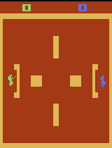

### Combat: Invisible Tank Pong

This environment is part of the [Atari environments](../atari.md). Please read that page first for general information.

| Observations | Actions | Agents  | Manual Control | Action Shape | Action Values | Observation Shape | Observation Values | Num States |
|--------------|---------|---------|----------------|--------------|---------------|-------------------|--------------------|------------|
| Graphical    | Discrete  | 2 | No      | (1,)    | [0,17]         | (210, 160, 3)         | (0,255)            | ?          |

`from pettingzoo.atari import combat_invisible_tankpong_v0`

`agents= ["first_0", "second_0"]`

*AEC diagram*

*Combat*'s invisible tank pong mode is an adversarial game where prediction, memory, and positioning are key.

The players move around the map invisibly. They are only visible when firing or when running into the sides of the map. The bullet bounces off obstacles, allowing you to shoot around corners. When your opponent is hit by your bullet,
you score a point.

Whenever you score a point, you are rewarded +1 and your opponent is penalized -1.

#### Environment parameters

Environment parameters are common to all Atari environments and are described in the [base Atari documentation](../atari.md) .
