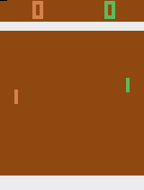

### Pong: Original

This environment is part of the [Atari environments](../atari.md). Please read that page first for general information.

| Observations | Actions | Agents  | Manual Control | Action Shape | Action Values | Observation Shape | Observation Values | Num States |
|--------------|---------|---------|----------------|--------------|---------------|-------------------|--------------------|------------|
| Graphical    | Discrete  | 2-4 | No      | (1,)    | [0,17]         | (210, 160, 3)         | (0,255)            | ?          |

`from pettingzoo.atari import pong_v0`

`agents= ["first_0", "second_0"]`



*AEC diagram*

Classic two player competitive game of timing.

Get the ball past the opponent(s) into the scoring area.

Scoring a point gives you +1 reward and your opponent -1 reward.


#### Environment parameters

Some environment parameters are common to all Atari environments and are described in the [base Atari documentation](../atari.md).

Parameters specific to pong are

```
pong.env(num_players=2, game_version="classic")
```

```
num_players: Number of players. Must either be 2 or 4.

game_version. Must be one of
    * "classic"
    * "two_paddles"
    * "soccer"
    * "foozpong"
    * "hockey"
    * "handball"
    * "volleyball"
    * "basketball"
    * "quadrapong" (4 player only)
```
