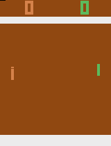

### Pong: Doubles

This environment is part of the [Atari environments](../atari.md). Please read that page first for general information.

| Observations | Actions | Agents  | Manual Control | Action Shape | Action Values | Observation Shape | Observation Values | Num States |
|--------------|---------|---------|----------------|--------------|---------------|-------------------|--------------------|------------|
| Graphical    | Discrete  | 4 | No      | (1,)    | [0,17]         | (210, 160, 3)         | (0,255)            | ?          |

`from pettingzoo.atari import pong_four_player_v0`

`agents= ["first_0", "second_0", "third_0", "fourth_0"]`

*AEC diagram*

Four player team battle.

Pong, with two players on each team. Each player controls a paddle.

Scoring a point gives your team +1 reward and your opponent -1 reward.

#### Environment parameters

Environment parameters are common to all Atari environments and are described in the [base Atari documentation](../atari.md) .
