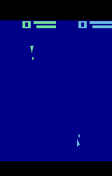

### Space War

This environment is part of the [Atari environments](../atari). Please read that page first for general information.

`from pettingzoo.atari import space_war_v0`

`agents= ["first_0", "second_0"]`

*AEC diagram*

*Space war* is an competitive game where prediction and positioning are key.

The players move around the map. When your opponent is hit by your bullet,
you score a point. The game is similar to combat, but with a more advanced physics system where acceleration and momentum need to be taken into account.

Whenever you score a point, you are rewarded +1 and your opponent is penalized -1.

[Official space war manual](https://atariage.com/manual_html_page.php?SoftwareLabelID=470)

#### Environment parameters

Environment parameters are common to all Atari environments and are described in the [base Atari documentation](../atari) .
