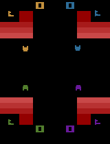

### Warlords

This environment is part of the [Atari environments](../atari). Please read that page first for general information.



`from pettingzoo.atari import warlords_v0`

`agents= ["first_0", "second_0", "third_0", "fourth_0"]`

*AEC diagram*

Four player last man standing!

Defend your fortress from the ball and hit it towards your opponents.

If you are the last player standing, you receive +1 reward.

Note that due to a standing bug in the implementation, the players are not done when their fortress is destroyed and cannot move, nor is their reward penalized.

[Official wizard_of_wor manual](https://atariage.com/manual_html_page.php?SoftwareLabelID=598)

#### Environment parameters

Environment parameters are common to all Atari environments and are described in the [base Atari documentation](../atari) .
