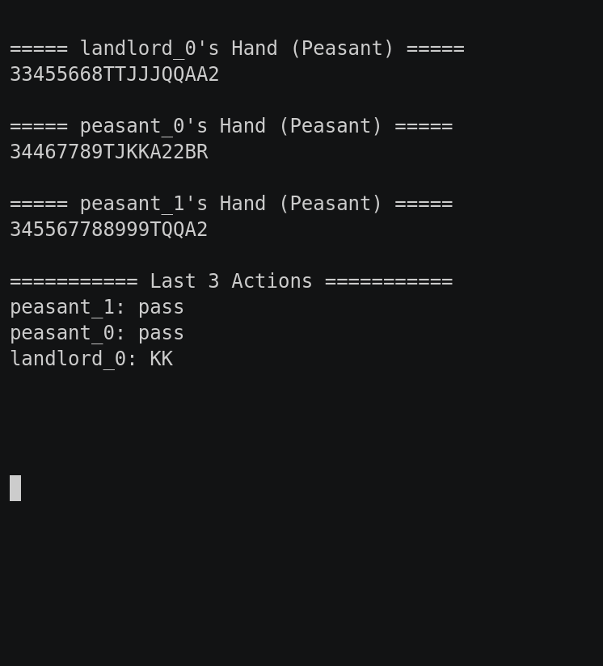

### Dou Dizhu

This game part of the [classic games](../classic.md), please visit that page first for general information about these games.

| Actions  | Agents | Manual Control | Action Shape  | Action Values  | Observation Shape | Observation Values | Num States    |
|----------|--------|----------------|---------------|----------------|-------------------|--------------------|---------------|
| Discrete | 3      | No             | Discrete(309) | Discrete(309)  | (6, 5, 15)        | [0,1]              | 10^53 - 10^83 |

`from pettingzoo.classic import dou_dizhu_v0`

`agents= ['landlord_0', 'peasant_0', 'peasant_1']`



*AEC Diagram*

Dou Dizhu, or *Fighting the Landlord*, is a shedding game involving 3 players and a deck of cards plus 2 jokers with suits being irrelevant. Heuristically, one player is designated the "Landlord" and the others become the "Peasants". The objective of the game is to be the first one to have no cards left. If the first person to have no cards left is part of the "Peasant" team, then all members of the "Peasant" team receive a reward (+1). If the "Landlord" wins, then only the "Landlord" receives a reward (+1).

The "Landlord" plays first by putting down a combination of cards. The next player, may pass or put down a higher combination of cards that beat the previous play. There are many legal combinations of cards, outlined in detail in Dou Dizhu's [Wikipedia article](https://en.wikipedia.org/wiki/Dou_dizhu).

Our implementation wraps [RLCard](http://rlcard.org/games.html#dou-dizhu) and you can refer to its documentation for additional details. Please cite their work if you use this game in research.


### Environment arguments

```
dou_dizhu.env(seed=None)
```

```
seed: seed for random values. Set to None to use machine random source. Set to fixed value for deterministic behavior
```


#### Observation Space

The *Observation Space* is encoded in 6 planes with 5x15 entries each. For each plane, the 5 rows represent 0, 1, 2, 3, or 4 cards of the same rank and the 15 columns represents all possible ranks ("3, 4, 5, 6, 7, 8, 9, 10, J, Q, K, A, 2, Black Joker, and Red Joker"). The first plane, Plane 0, is the current player while Plane 1, Plane 2-4, and Plane 5 correspond to the union of the other two players' hand, the recent three actions, and the union of all played cards, respectively.

| Plane | Description                      |
|:-----:|----------------------------------|
|   0   | Current Player's hand            |
|   1   | Union of the other players' hand |
| 2 - 4 | Recent three actions             |
|   5   | Union of all played card         |

##### Encoding per Plane

| Plane Row Index |          Description          |
|:---------------:| ----------------------------- |
|        0        | 0 matching cards of same rank |
|        1        | 1 matching cards of same rank |
|        2        | 2 matching cards of same rank |
|        3        | 3 matching cards of same rank |
|        4        | 4 matching cards of same rank |

| Plane Column Index | Description |
|:------------------:|-------------|
|          0         | 3           |
|          1         | 4           |
|         ...        | ...         |
|          7         | 10          |
|          8         | Jack        |
|          9         | Queen       |
|         10         | King        |
|         11         | Ace         |
|         12         | 2           |
|         13         | Black Joker |
|         14         | Red Joker   |

#### Action Space

The raw size of the action space of Dou Dizhu is 33,676. Because of this, our implementation of Dou Dizhu abstracts the action space into 309 actions as shown below. The core idea is to abstract actions by only focusing on the major combination and ignoring the kicker (e.g. a trio with single "4445" would be "444&ast;"). As a reminder, suits are irrelevant in Dou Dizhu.

| Action Type      | Description                                                                         | Number of Actions | Number of Actions after Abstraction | Action ID | Example                                                                                                                                                                                                                                                          |
|------------------|-------------------------------------------------------------------------------------|-------------------|-------------------------------------|-----------|------------------------------------------------------------------------------------------------------------------------------------------------------------------------------------------------------------------------------------------------------------------|
| Solo             | Any single card                                                                     | 15                | 15                                  | 0-14      | `0`: 3, `1`: 4, ..., `12`: 2, `13`: Black Joker, `14`: Red Joker                                                                                                                                                                                                 |
| Pair             | Two matching cards of equal rank                                                    | 13                | 13                                  | 15-27     | `15`: 33, `16`: 44, ..., `25`: KK, `26`: AA, `27`: 22                                                                                                                                                                                                            |
| Trio             | Three matching cards of equal rank                                                  | 13                | 13                                  | 28-40     | `28`: 333, `29`: 444, ..., `38`: KKK, `39`: AAA, `40`: 222                                                                                                                                                                                                       |
| Trio with single | Three matching cards of equal rank + single card of next higher rank (e.g. 3334)    | 182               | 13                                  | 41-53     | `41`: 333&ast;, `42`: 444&ast;, ..., `51`: KKK&ast;, `52`: AAA&ast;, `53`: 222&ast;                                                                                                                                                                              |
| Trio with pair   | Three matching cards of equal rank + pair of cards of next higher rank (e.g. 33344) | 156               | 13                                  | 54-66     | `54`: 333&ast;&ast;, `55`: 444&ast;&ast;, ..., `64`: KKK&ast;&ast;, `65`: AAA&ast;&ast;, `66`: 222&ast;&ast;                                                                                                                                                     |
| Chain of solo    | At least five consecutive solo cards                                                | 36                | 36                                  | 67-102    | `67`: 34567, `68`: 45678, ..., `100`: 3456789TJQK, `101`: 456789TJQKA, `102`: 3456789TJQKA                                                                                                                                                                       |
| Chain of pair    | At least three consecutive pairs                                                    | 52                | 52                                  | 103-154   | `103`: 334455, `104`: 445566, ..., `152`: 33445566778899TTJJQQ, `153`: 445566778899TTJJQQKK, `154`: 5566778899TTJJQQKKAA                                                                                                                                         |
| Chain of trio    | At least two consecutive trios                                                      | 45                | 45                                  | 155-199   | `155`: 333444, `156`: 444555, ..., `197`: 777888999TTTJJJQQQ, `198`: 888999TTTJJJQQQKKK, `199`: 999TTTJJJQQQKKKAAA                                                                                                                                               |
| Plane with solo  | Two consecutive trios + 2 consecutive solo cards (e.g. 33344456)                    | 24721             | 38                                  | 200-237   | `200`: 333444&ast;&ast;, `201`: 444555&ast;&ast;, ..., `235`: 888999TTTJJJQQQ&ast;&ast;&ast;&ast;&ast;, `236`: 999TTTJJJQQQKKK&ast;&ast;&ast;&ast;&ast;, `237`: TTTJJJQQQKKKAAA&ast;&ast;&ast;&ast;&ast;                                                         |
| Plane with pair  | Two consecutive trios + 2 consecutive pairs (e.g. 3334445566)                       | 6552              | 30                                  | 238-267   | `238`: 333444&ast;&ast;&ast;&ast;, `239`: 444555&ast;&ast;&ast;&ast;, ..., `265`: 999TTTJJJQQQ&ast;&ast;&ast;&ast;&ast;&ast;&ast;&ast;, `266`: TTTJJJQQQKKK&ast;&ast;&ast;&ast;&ast;&ast;&ast;&ast;, `267`: JJJQQQKKKAAA&ast;&ast;&ast;&ast;&ast;&ast;&ast;&ast; |
| Quad with solo   | Four matching cards of equal rank + 2 consecutive solo cards (e.g 333345)           | 1339              | 13                                  | 268-280   | `268`: 3333&ast;&ast;, `269`: 4444&ast;&ast;, ..., `278`: KKKK&ast;&ast;, `279`: AAAA&ast;&ast;, `280`: 2222&ast;&ast;                                                                                                                                           |
| Quad with pair   | Four matching cards of equal rank + 2 consecutive pair (e.g 33334455)               | 1014              | 13                                  | 281-293   | `281`: 3333&ast;&ast;&ast;&ast;, `282`: 4444&ast;&ast;&ast;&ast;, ..., `291`: KKKK&ast;&ast;&ast;&ast;, `292`: AAAA&ast;&ast;&ast;&ast;, `293`: 2222&ast;&ast;&ast;&ast;                                                                                         |
| Bomb             | Four matching cards of equal rank                                                   | 13                | 13                                  | 294-306   | `294`: 3333, `295`: 4444, ..., `304`: KKKK, `305`: AAAA, `306`: 2222                                                                                                                                                                                             |
| Rocket           | Black Joker + Red Joker                                                             | 1                 | 1                                   | 307       | `307`: Black Joker (B) + Red Joker (R)                                                                                                                                                                                                                           |
| Pass             | Pass                                                                                | 1                 | 1                                   | 308       | `308`: Pass                                                                                                                                                                                                                                                      |
| Total            |                                                                                     | 33676             | 309                                 |           |                                                                                                                                                                                                                                                                  |                                                                                                                                                                                                                            |

For example, you would use action `0` to play a single "3" card or action `30` to play a trio of "5".

#### Rewards

We modified the reward structure compared to RLCard. Instead of rewarding `0` to the losing player, we assigned a `-1` reward to the losing agent.

| Winner | Loser |
| :----: | :---: |
| +1     |   -1  |

#### Legal Moves

The legal moves available for each agent, found in `env.infos[agent]['legal_moves']`, are updated after each step. Taking an illegal move ends the game with a reward of -1 for the illegally moving agent and a reward of 0 for all other agents.
