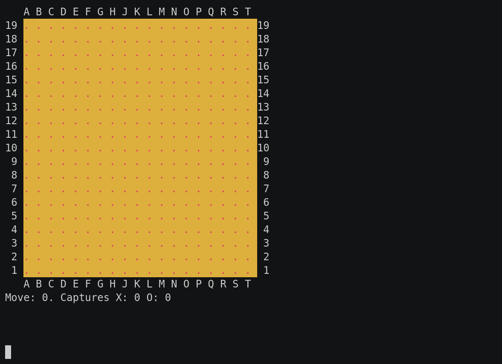

### Go

This game part of the [classic games](../classic.md), please visit that page first for general information about these games.

 Actions  | Agents | Manual Control | Action Shape    | Action Values   | Observation Shape | Observation Values | Num States |
----------|--------|----------------|-----------------|-----------------|-------------------|--------------------|------------|
 Discrete | 2      | No             | Discrete(N^2+1) | Discrete(N^2+1) | (N, N, 3)         | [0, 1]             | 3^(N^2)    |

`from pettingzoo.classic import go_v0`

`agents= ['black_0', 'white_0']`



*AEC Diagram*

Go is a board game with 2 players, black and white. The black player starts by placing a black stone at an empty board intersection. The white player follows with the purpuse of surrounding more territory than the opponent or capturing the opponent's stones. The game ends if both players sequentially decide to pass. Refer to [Wikipedia](https://en.wikipedia.org/wiki/Go_(game)) for additional details about the game.

Our implementation is a wrapper for [MiniGo](https://github.com/tensorflow/minigo).

#### Arguments

Go takes two optional arguments that define the board size (int) and komi (float) compensation points. The default values for the board size and komi are 19 and 7.5, respectively.

`g0_v0.env(board_size = 13, komi = 2.5)`

`g0_v0.env() # with default values`

#### Observation Space

The observation shape is a function of the board size _N_ and has a shape of (N, N, 3). The first plane, (:,:,0), represent the stones on the board for the current player while the second plane, (:,:,1), encodes the stones of the opponent. The third plane, (:,:,2), is all 1 if the current player is `black_0` or all 0 if the player is `white_0`. The state of the board is represented with the top left corner as (0, 0). For example, a (9, 9) board is  
```
   0 1 2 3 4 5 6 7 8
 0 . . . . . . . . .  0
 1 . . . . . . . . .  1
 2 . . . . . . . . .  2
 3 . . . . . . . . .  3
 4 . . . . . . . . .  4
 5 . . . . . . . . .  5
 6 . . . . . . . . .  6
 7 . . . . . . . . .  7
 8 . . . . . . . . .  8
   0 1 2 3 4 5 6 7 8
```

|  Plane  | Description                                               |
|:-------:|-----------------------------------------------------------|
|    0    | Current Player's stones<br>_'`0`: no stone, `1`: stone_   |
|    1    | Opponent Player's stones<br>_'`0`: no stone, `1`: stone_  |
|    2    | Player<br>_'`0`: white, `1`: black_                       |

While rendering, the board coordinate system is [GTP](http://www.lysator.liu.se/~gunnar/gtp/).

#### Action Space

Similar to the observation space, the action space is dependent on the board size _N_.

|   Action ID   | Description                                                                                                   |
|:-------------:|---------------------------------------------------------------------------------------------------------------|
|    0 ~ N-1    | Place a stone on the 1st row of the board.<br>_`0`: (0,0), `1`: (0,1), ..., `N-1`: (0,N-1)_                   |
|    N ~ 2N-1   | Place a stone on the 2nd row of the board.<br>_`N`: (1,0), `N+1`: (1,1), ..., `2N-1`: (1,N-1)_                |
|      ...      | ...                                                                                                           |
| N^2-N ~ N^2-1 | Place a stone on the Nth row of the board.<br>_`N^2-N`: (N-1,0), `N^2-N+1`: (N-1,1), ..., `N^2-1`: (N-1,N-1)_ |
|      N^2      | Pass                                                                                                          |

For example, you would use action `4` to place a stone on the board at the (0,3) location or action `N^2` to pass.

#### Rewards

| Winner | Loser |
| :----: | :---: |
| +1     | -1    |

#### Legal Moves

The legal moves available for each agent, found in `env.infos[agent]['legal_moves']`, are updated after each step. Taking an illegal move ends the game with a reward of -1 for the illegally moving agent and a reward of 0 for all other agents.
