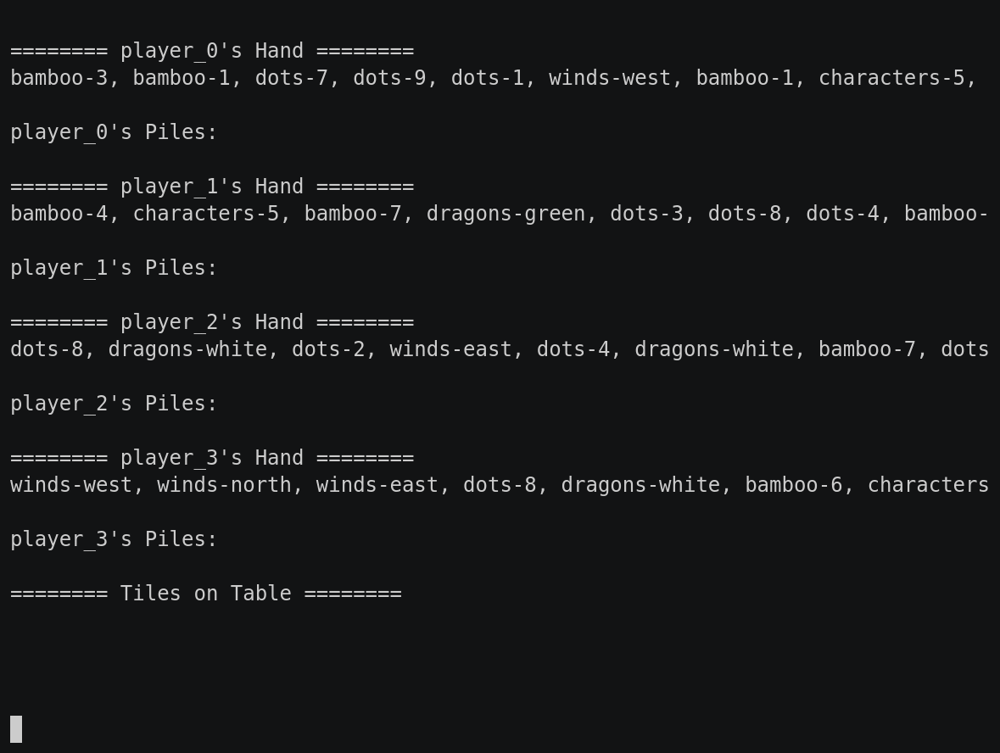

### Mahjong

This game part of the [classic games](../classic.md), please visit that page first for general information about these games.

| Actions  | Agents | Manual Control | Action Shape | Action Values | Observation Shape | Observation Values | Num States |
|----------|--------|----------------|--------------|---------------|-------------------|--------------------|------------|
| Discrete | 4      | No             | Discrete(38) | Discrete(38)  | (6, 34, 4)        | [0, 1]             | 10^121     |

`from pettingzoo.classic import mahjong_v0`

`agents= ['player_0', 'player_1', 'player_2', 'player_3']`



*AEC Diagram*

Mahjong is a tile-based game with 4 players and 136 tiles, which includes 4 identical sets of 34 unique tiles. The objective is to form 4 sets and a pair with the 14th drawn tile. If no player wins, no player receives a reward.

Our implementation wraps [RLCard](http://rlcard.org/games.html#mahjong) and you can refer to its documentation for additional details. Please cite their work if you use this game in research.


### Environment arguments

```
mahjong.env(seed=None)
```

```
seed: seed for random values. Set to None to use machine random source. Set to fixed value for deterministic behavior
```

#### Observation Space

The observation space has a (6, 34, 4) shape with the first index representing the encoding plane. Plane 0 represent the current player's hand, Plane 1 represent the played cards on the table, and Planes 2-5 encode the public piles of each player (Plane 2: Player 0, Plane 3: Player 1, Plane 4: Player 2, and Plane 5: Player 3).

| Plane | Description               |
|:-----:|---------------------------|
|   0   | Current Player's hand     |
|   1   | Played tiles on the table |
|   2   | Public piles of player_0  |
|   3   | Public piles of player_1  |
|   4   | Public piles of player_2  |
|   5   | Public piles of player_3  |

##### Encoding per Plane

| Plane Row Index | Description                                   |
|:---------------:|-----------------------------------------------|
|      0 - 8      | Bamboo<br>_`0`: 1, `1`: 2, ..., `8`: 9_       |
|      9 - 17     | Characters<br>_`9`: 1, `10`: 2, ..., `17`: 9_ |
|     18 - 26     | Dots<br>_`18`: 1, `19`: 2, ..., `26`: 9_      |
|        27       | Dragons Green                                 |
|        28       | Dragons Red                                   |
|        29       | Dragons White                                 |
|        30       | Winds East                                    |
|        31       | Winds West                                    |
|        32       | Winds North                                   |
|        33       | Winds South                                   |

| Plane Column Index | Description |
|:------------------:|-------------|
|          0         | Tile Set 1  |
|          1         | Tile Set 2  |
|          2         | Tile Set 3  |
|          3         | Tile Set 4  |

#### Action Space

The action space, as described by RLCard, is

| Action ID   | Action                                         |
| :---------: | ---------------------------------------------- |
| 0 - 8       | Bamboo<br>_`0`: 1, `1`: 2, ..., `8`: 9_        |
| 9 - 17      | Characters<br>_`9`: 1, `10`: 2, ..., `17`: 9_  |
| 18 - 26     | Dots<br>_`18`: 1, `19`: 2, ..., `26`: 9_       |
| 27          | Dragons Green                                  |
| 28          | Dragons Red                                    |
| 29          | Dragons White                                  |
| 30          | Winds East                                     |
| 31          | Winds West                                     |
| 32          | Winds North                                    |
| 33          | Winds South                                    |
| 34          | Pong                                           |
| 35          | Chow                                           |
| 36          | Gong                                           |
| 37          | Stand                                          |

For example, you would use action `34` to pong or action `37` to stand.

#### Rewards

| Winner | Loser |
| :----: | :---: |
| +1     | -1    |

#### Legal Moves

The legal moves available for each agent, found in `env.infos[agent]['legal_moves']`, are updated after each step. Taking an illegal move ends the game with a reward of -1 for the illegally moving agent and a reward of 0 for all other agents.
