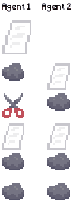

### Rock Paper Scissors

This game part of the [classic games](../classic), please visit that page first for general information about these games.



`from pettingzoo.classic import rps_v0`

`agents= ['player_0', 'player_1']`

Rock, Paper, Scissors is a 2-player hand game where each player chooses either rock, paper or scissors and reveals their choices simultaenously. If both players make the same choice, then it is a draw. However if their choices are different, the winner is determined as follows: rock beats scissors, scissors beat paper and paper beats rock. 

#### Observation Space

The observation space is a scalar value with 4 possible values. Since both players reveal their choices at the same time, the observation is None until both players have acted. Therefore, 3 represents no action taken yet. Rock is represented with 0, paper with 1 and scissors with 2.

| Value  |  Observation |
| :----: | :---------:  |
| 0      | Rock         |
| 1      | Paper        |
| 2      | Scissors     |
| 3      | None         |

### Action Space

The action space is a scalar vlue with 3 possible values. The values are encoded as follows: Rock is 0, paper is 1 and scissors is 2.

| Value  |  Action |
| :----: | :---------:  |
| 0      | Rock         |
| 1      | Paper        |
| 2      | Scissors     |

#### Rewards

| Winner | Loser |
| :----: | :---: |
| +1     | -1    |

If the game ends in a draw, both players will receive a reward of 0.
