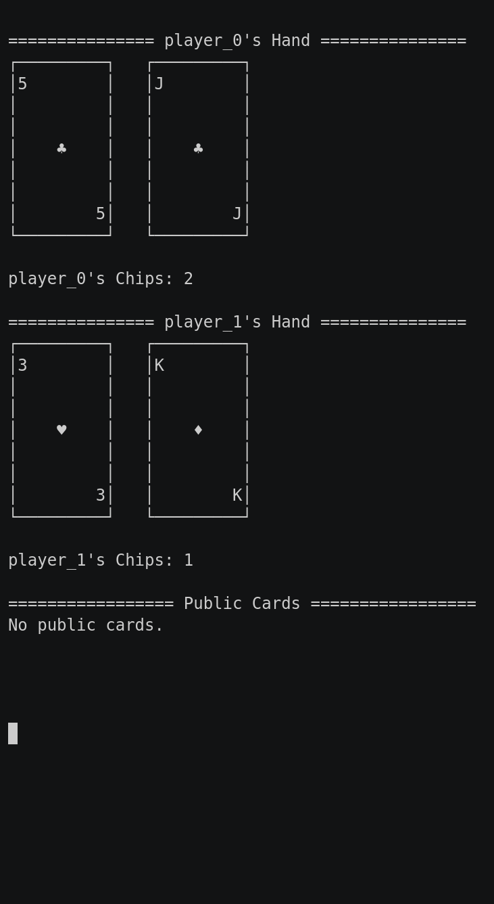

### Texas Hold'em No Limit

This game part of the [classic games](../classic.md), please visit that page first for general information about these games.

| Actions  | Agents | Manual Control | Action Shape  | Action Values | Observation Shape | Observation Values | Num States |
|----------|--------|----------------|---------------|---------------|-------------------|--------------------|------------|
| Discrete | 2      | No             | Discrete(103) | Discrete(103) | (54,)             | [0, 100]           | 10^162     |

`from pettingzoo.classic import texas_holdem_no_limit_v0`

`agents= ['player_0', 'player_1']`



*AEC Diagram*

Texas Hold'em No Limit is a variation of Texas Hold'em where there is no limit on the amount of raise or the number of raises.

Our implementation wraps [RLCard](http://rlcard.org/games.html#no-limit-texas-hold-em) and you can refer to its documentation for additional details. Please cite their work if you use this game in research.


### Environment arguments

```
texas_holdem.env(seed=None)
```

```
seed: seed for random values. Set to None to use machine random source. Set to fixed value for deterministic behavior
```

#### Observation Space

The observation space is similar to Texas Hold'em. The first 52 entries represent the current player's hand with any community card.

|  Index  | Description                                  |  Values  |
|:-------:|----------------------------------------------|:--------:|
|  0 - 12 | Spades<br>_`0`: A, `1`: 2, ..., `12`: K_     |  [0, 1]  |
| 13 - 25 | Hearts<br>_`13`: A, `14`: 2, ..., `25`: K_   |  [0, 1]  |
| 26 - 38 | Diamonds<br>_`26`: A, `27`: 2, ..., `38`: K_ |  [0, 1]  |
| 39 - 51 | Clubs<br>_`39`: A, `40`: 2, ..., `51`: K_    |  [0, 1]  |
|    52   | Number of Chips of player_0                  | [0, 100] |
|    53   | Number of Chips of player_1                  | [0, 100] |

#### Action Space

| Action ID | Action                                                      |
|:---------:|-------------------------------------------------------------|
|     0     | Call                                                        |
|     1     | Raise                                                       |
|     2     | Check                                                       |
|  3 - 102  | Raise<br>_`3`: 1 chip, `4`: 2 chips, ..., `102`: 100 chips_ |

#### Rewards

| Winner          | Loser           |
| :-------------: | :-------------: |
| +raised chips/2 | -raised chips/2 |

#### Legal Moves

The legal moves available for each agent, found in `env.infos[agent]['legal_moves']`, are updated after each step. Taking an illegal move ends the game with a reward of -1 for the illegally moving agent and a reward of 0 for all other agents.
