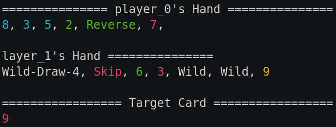

### Uno

This game part of the [classic games](../classic.md), please visit that page first for general information about these games.

| Actions  | Agents | Manual Control | Action Shape | Action Values | Observation Shape | Observation Values | Num States |
|----------|--------|----------------|--------------|---------------|-------------------|--------------------|------------|
| Discrete | 2      | No             | Discrete(61) | Discrete(61)  | (7, 4, 15)        | [0, 1]             | 10^163     |

`from pettingzoo.classic import uno_v0`

`agents= ['player_0', 'player_1']`



*AEC Diagram*

Uno is shedding game involving 2 players. At the beginning, each player receives 7 cards and the winner is determined as the first player with no cards left. In order to get rid of a card, a player must match either the color and number of the card on top of the discard pile. If the player does not have a card to discard, then it will take a card from the Draw pile. The deck of cards include 4 colors (blue, green, yellow, and red), 10 numbers (0 to 9), and special cards (Wild Draw Four, Skip, Reverse).

Our implementation wraps [RLCard](http://rlcard.org/games.html#uno) and you can refer to its documentation for additional details. Please cite their work if you use this game in research.


### Environment arguments

```
uno.env(seed=None)
```

```
seed: seed for random values. Set to None to use machine random source. Set to fixed value for deterministic behavior
```

#### Observation Space

The observation space has a shape of (7, 4, 15). The first index represent the plane, the second index the color, and the last index the card number (including any special card).

| Plane | Feature                                                   |
| :---: | --------------------------------------------------------- |
| 0     | Player's Hand with 0 cards of the same color and number   |
| 1     | Player's Hand with 1 card of the same color and number    |
| 2     | Player's Hand with 2 cards of the same color and number   |
| 3     | Target card (top of the Discard pile)                     |
| 4     | Opponent's Hand with 0 cards of the same color and number |
| 5     | Opponent's Hand with 1 cards of the same color and number |
| 6     | Opponent's Hand with 2 cards of the same color and number |

##### Encoding per Plane

| Plane Row Index | Description |
|:---------------:|-------------|
|        0        | Red         |
|        1        | Green       |
|        2        | Blue        |
|        3        | Yellow      |

| Plane Column Index | Description    |
|:------------------:|----------------|
|        0           | 0              |
|        1           | 1              |
|        2           | 2              |
|       ...          | ...            |
|        9           | 9              |
|        10          | Wild           |
|        11          | Wild Draw Four |
|        12          | Skip           |
|        13          | Draw Two       |
|        14          | Reverse        |

#### Action Space

The action space is as described by RLCards.

| Action ID |                                     Action                                     |
|:---------:| ------------------------------------------------------------------------------ |
|  0 - 9    | Red number cards<br>_`0`: 0-Red, `1`: 1-Red, ..., `9`: 9-Red_                  |
| 10 - 12   | Red action cards<br>_`10`: Skip, `11`: Reverse, `12`: Draw 2_                  |
|     13    | Red "Wild" card                                                                |
|     14    | Red "Wild and Draw 4" card                                                     |
| 15 - 24   | Green number cards<br>_`15`: 0-Green, `16`: 1-Green, ..., `24`: 9-Green_       |
| 25 - 27   | Green action cards<br>_`25`: Skip, `26`: Reverse, `27`: Draw 2_                |
|     28    | Green "Wild" card                                                              |
|     29    | Green "Wild and draw 4" card                                                   |
| 30 - 39   | Blue number cards<br>_`30`: 0-Blue, `31`: 1-Blue, ..., `39`: 9-Blue_           |
| 40 - 42   | Blue action cards<br>_`40`: Skip, `41`: Reverse, `42`: Draw 2_                 |
|     43    | Blue "Wild" card                                                               |
|     44    | Blue "Wild and Draw 4" card                                                    |
| 45 - 54   | Yellow number cards<br>_`45`: 0-Yellow, `46`: 1-Yellow, ..., `54`: 9-Yellow_   |
| 55 - 57   | Yellow action cards<br>_`55`: Skip, `56`: Reverse, `57`: Draw 2_               |
|     58    | Yellow "Wild" card                                                             |
|     59    | Yellow "Wild and Draw 4" card                                                  |
|     60    | Draw                                                                           |

For example, you would use action `6` to put down a red "6" card or action `60` to draw a card.

#### Rewards

| Winner | Loser |
| :----: | :---: |
| +1     | -1    |

#### Legal Moves

The legal moves available for each agent, found in `env.infos[agent]['legal_moves']`, are updated after each step. Taking an illegal move ends the game with a reward of -1 for the illegally moving agent and a reward of 0 for all other agents.
