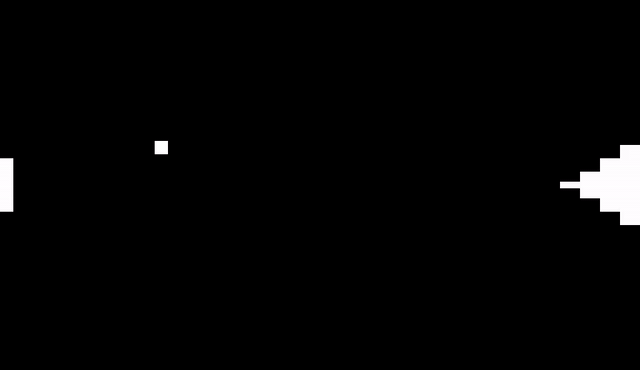
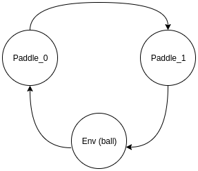

## Gamma Environments

| Environment             | Actions    | Agents  | Manual Control | Action Shape | Action Values | Observation Shape | Observation Values | Num States |
|:------------------------|:-----------|:-------:|:--------------:|:------------:|:-------------:|:-----------------:|:------------------:|----------:|
| Cooperative Pong        | Discrete   | 2       | Yes            | ?            | ?             | ?                 | ?                  | ?          |
| Knights Archers Zombies | Discrete   | 4 (+/-) | Yes            | (1,)         | [0, 5]        | (512, 512, 3)     | (0, 255)           | ?          |
| Pistonball              | Either     | 20      | Yes            | (1,)         | [0, 2]        | (200, 120, 3)     | (0, 255)           | ?          |
| Prison                  | Either     | 8 (+/-) | Yes            | (1,)         | [0, 2]        | (100, 300, 3)     | (0, 255)           | ?          |
| Prospector              | Continuous | 7 (+/-) | Yes            | ?            | ?             | ?                 | ?                  | ?          |

`pip install pettingzoo[gamma]`

All Gamma environments were created by us, using PyGame, with visual Atari spaces. In Prison, all agents are completely independent (i.e. no coordination is possible, each agent is in it's own cell. It is intended as a debugging tool.

All other environments require a high degree of coordination and learning emergent behaviors to achieve an optimal policy. As such, these environments are currently very challenging to learn.

All environments are highly configurable with environment arguments.

### Cooperative Pong
| Actions  | Agents | Manual Control | Action Shape | Action Values | Observation Shape | Observation Values | Num States |
|:---------|:------:|:--------------:|:------------:|:-------------:|:-----------------:|:------------------:|:----------:|
| Discrete | 2      | Yes            |      --      |   [0, 1]      |  (560, 480, 3)    |   [0, 255]         | ?          |

`from pettingzoo.gamma import cooperative_pong_v0`

`agents= ["paddle_0", "paddle_1"]`

Example gameplay:



AEC diagram:



Cooperative pong is a game of simple pong, where the objective is to keep the ball in play for the longest time. The game is over when the ball goes out of bounds from either the left or right edge of the screen. There are two agents (paddles), one that moves along the left edge and the other that moves along the right edge of the screen. All collisions of the ball are elastic. The ball always starts moving in a random direction from the center of the screen with each reset. To make learning a little more challenging, the right paddle is tiered cake-shaped , by default. Observation space of each agent is its own half of the screen. There are two possible actions for the agents (_move up/down_). If the ball stays within bounds, both agents receive a combined reward of `100 / max_frames` (default 0.11), if they successfully complete a frame. Otherwise, each agent receive a reward of `-100` and the game ends. 


Manual Control:

Move the left paddle using the 'W' and 'S' keys. Move the right paddle using 'UP' and 'DOWN' arrow keys.

```
cooperative_pong.env(ball_speed=18, left_paddle_speed=25,
right_paddle_speed=25, cake_paddle=True, max_frames=900, bounce_randomness=False)
```

The speed of the ball (`ball_speed` )is held constant throughout the game, while the initial direction of the ball is randomized when `reset()` method is called. The speed of left and right paddles are controlled by `left_paddle_speed` and `right_paddle_speed` respectively. If `cake_paddle` is `True`, the right paddle has the shape of a 4-tiered wedding cake. `done` of all agents are set to `True` after `max_frames` number of frames elapse. If `bounce_randomness` is `True`, each collision of the ball with the paddles adds a small random angle to the direction of the ball, while the speed of the ball remains unchanged.

Leaderboard:

| Average Total Reward | Method | Institution | Paper | Code |
|----------------------|--------|-------------|-------|------|
| x                    | x      | x           | x     | x    |


### Knights Archers Zombies ('KAZ')
| Actions  | Agents  | Manual Control | Action Shape | Action Values | Observation Shape | Observation Values | Num States |
|----------|---------|----------------|--------------|---------------|-------------------|--------------------|------------|
| Discrete | 4 (+/-) | Yes            | (1,)         | [0, 5]        | (512, 512, 3)     | (0, 255)           | ?          |

`from pettingzoo.gamma import knights_archers_zombies_v0`

`agents= ["archer_0", "archer_1", "knight_0", "knight_1"]`

*gif*

*AEC diagram*

Zombies walk from the top border of the screen down to the bottom border in unpredictable paths. The agents you control are knights and archers (default 2 knights and 2 archers) that are initially positioned at the bottom border of the screen. Each agent can rotate clockwise or counter-clockwise and move forward or backward. Each agent can also attack to kill zombies. When a knight attacks, it swings a mace in an arc in front of its current heading direction. When an archer attacks, it fires an arrow in a straight line in the direction of the archer's heading. The game ends when all agents die (collide with a zombie) or a zombie reaches the bottom screen border. A knight is rewarded 1 point when its mace hits and kills a zombie. An archer is rewarded 1 point when one of their arrows hits and kills a zombie. Each agent observes the environment as a square region around itself, with its own body in the center of the square. The observation is represented as a 512x512 pixel image around the agent, or in other words, a 16x16 agent sized space around the agent.

Manual Control:

Move the archer using the 'W', 'A', 'S' and 'D' keys. Shoot the Arrow using 'F' key. Rotate the archer using 'Q' and 'E' keys.
Press 'X' key to spawn a new archer.

Move the knight using the 'I', 'J', 'K' and 'L' keys. Stab the Sword using ';' key. Rotate the knight using 'U' and 'O' keys.
Press 'M' key to spawn a new knight.


```
knights_archers_zombies.env(spawn_rate=20, knights=2, archers=2, 
killable_knights=True, killable_archers=True, black_death=True, line_death=True, pad_observation=True, max_frames=900)
```

*about arguments*

```
spawn_rate: how many cycles before a new zombie is spawned. A lower number means zombies are spawned at a higher rate.

knights: how many knight agents initially spawn.

archers: how many archer agents initially spawn.

killable_knights: if set to False, knight agents cannot be killed by zombies.

killable_archers: if set to False, archer agents cannot be killed by zombies.

black_death: if set to True, agents who die will observe only black. If False, dead agents do not have reward, done, info or observations and are removed from agent list.

line_death: if set to False, agents do not die when they touch the top or bottom border. If True, agents die as soon as they touch the top or bottom border.

pad_observation: if agents are near edge of environment, their observation cannot form a 40x40 grid. If this is set to True, the observation is padded with black.
```

Leaderboard:

| Average Total Reward | Method | Institution | Paper | Code |
|----------------------|--------|-------------|-------|------|
| x                    | x      | x           | x     | x    |


### Pistonball
| Actions | Agents | Manual Control | Action Shape | Action Values | Observation Shape | Observation Values | Num States |
|---------|--------|----------------|--------------|---------------|-------------------|--------------------|------------|
| Either  | 20     | Yes            | (1,)         | [0, 2]        | (200, 120, 3)     | (0, 255)           | ?          |

`from pettingzoo.gamma import pistonball_v0`

`agents= ["piston_0", "piston_1", ..., "piston_19"]`

*gif*

*AEC diagram*

This is a simple physics based cooperative game where the goal is to move the ball to the left wall of the game border by activating any of the twenty vertically moving pistons. Pistons can only see themselves, and the two pistons next to them. 
Thus, pistons must learn highly coordinated emergent behavior to achieve an optimal policy for the environment. Each agent get's a reward that is a combination of how much the ball moved left overall, and how much the ball moved left if it was close to the piston (i.e. movement it contributed to). Balancing the ratio between these appears to be critical to learning this environment, and as such is an environment parameter. If the ball moves to the left, a positive global reward is applied. If the ball moves to the right then a negative global reward is applied. Additionally, pistons that are within a radius of the ball are given a local reward.

Pistonball uses the chipmunk physics engine, and are thus the physics are about as realistic as Angry Birds.

Keys *a* and *d* control which piston is selected to move (initially the rightmost piston is selected) and keys *w* and *s* move the piston in the vertical direction.

```
pistonball.env(local_ratio=.02, continuous=False, random_drop=True,
starting_angular_momentum=True, ball_mass = .75, ball_friction=.3,
ball_elasticity=1.5, max_frames=900)
```

*about arguments*

```
local_ratio: Weight applied to local reward and global reward. Global reward weight will always be 1 - local reward weight.

continuous: If true, piston action is a real value between -1 and 1 which is added to the piston height. If False, then action is a discrete value to move a unit up or down.

random_drop: If True, ball will initially spawn in a random x value. If False, ball will always spawn at x=800

starting_angular_moment: If True, ball will spawn with a random angular momentum

ball_mass: Sets the mass of the ball physics object

ball_friction: Sets the friction of the ball physics object

ball_elasticity: Sets the elasticity of the ball physics object
```

Discrete Leaderboard:

| Average Total Reward | Method | Institution | Paper | Code |
|----------------------|--------|-------------|-------|------|
| x                    | x      | x           | x     | x    |

Continuous Leaderboard:

| Average Total Reward | Method | Institution | Paper | Code |
|----------------------|--------|-------------|-------|------|
| x                    | x      | x           | x     | x    |


### Prison

| Actions | Agents | Manual Control | Action Shape | Action Values | Observation Shape | Observation Values | Num States |
|---------|--------|----------------|--------------|---------------|-------------------|--------------------|------------|
| Either  | 8      | Yes            | (1,)         | [0, 2]        | (100, 300, 3)     | (0, 255)           | ?          |

`from pettingzoo.gamma import prison_v0`

`agents= ["prisoner_0", "prisoner_1", ..., "prisoner_7"]`

*gif*

*AEC diagram*

In prison, 8 aliens locked in identical prison cells are controlled by the user. They cannot communicate with each other in any way, and can only pace in their cell. Every time they touch one end of the cell and then the other, they get a reward of 1. Due to the fully independent nature of these agents and the simplicity of the task, this is an environment primarily intended for debugging purposes- it's multiple individual purely single agent tasks. To make this debugging tool as compatible with as many methods as possible, it can accept both discrete and continuous actions and the observation can be automatically turned into a number representing position of the alien from the left of it's cell instead of the normal graphical output.

Arguments:

```
prison.env(graphical_output=True, discrete_input=True, synchronized_start=False,
identical_aliens=False, max_frames=900, random_aliens=False)
```

*about arguments*

```
graphics_output: If set to True an image of the prisoner's cell is observed. If set to False, the distance to the left side wall is returned.

discrete_input: If True, each agent action is a discrete value indicating whether to move left or right one unit. If False, each agent action represents a real value that is added to the agent's x position

synchronized_start: If set to true, all aliens will start in the same x position, relative to their cells. Otherwise, their position is random.

identical_aliens: If set to true, each alien will have the some randomly chosen sprite. This argument overrides the random_aliens argument.

random_aliens: If set to True, each alien's sprite is randomly chosen from all possible sprites. If random_aliens and synchronized_aliens are both False, each alien's sprite is chosen cyclically from all possible sprites.
```

Discrete Leaderboard:

| Average Total Reward | Method | Institution | Paper | Code |
|----------------------|--------|-------------|-------|------|
| x                    | x      | x           | x     | x    |

Continuous Leaderboard:

| Average Total Reward | Method | Institution | Paper | Code |
|----------------------|--------|-------------|-------|------|
| x                    | x      | x           | x     | x    |


### Prospector
| Actions    | Agents  | Manual Control | Action Shape | Action Values | Observation Shape | Observation Values | Num States |
|------------|---------|----------------|--------------|---------------|-------------------|--------------------|------------|
| Continuous | 7 (+/-) | Yes            | ?            | ?             | ?                 | ?                  | ?          |

`from pettingzoo.gamma import prospector_v0`

`agents= `

*gif*

*AEC diagram*

This game is inspired by gold panning in the American "wild west" movies. There's a blue river at the bottom of the screen, which contains gold. 4 "panner" agents can move and touch the river and pan from it, and get a gold nugget (visibly held by them). They take a 3 element vector of continuous values (the first for forward/backward, the second for left/right movement, the third for clockwise/counter-clockwise rotation). They can only hold 1 nugget at a time.

There are a handful of bank chests at the top of the screen. The panner agents can hand their held gold nugget to the 2 "manager" agents, to get a reward. The manager agents can't rotate, and the panner agents must give the nuggets (which are held in the front of their body) to the front (always pointing upwards) of the managers. The managers then get the gold, and can deposit it into the chests to recieve a reward. They take a 2 element vector of continuous values (the first for forward/backward, the second for left/right movement). They can only hold 1 nugget at a time. The game lasts for 900 frames by default.

*arguments*

*about arguments*

Leaderboard:

| Average Total Reward | Method | Institution | Paper | Code |
|----------------------|--------|-------------|-------|------|
| x                    | x      | x           | x     | x    |
