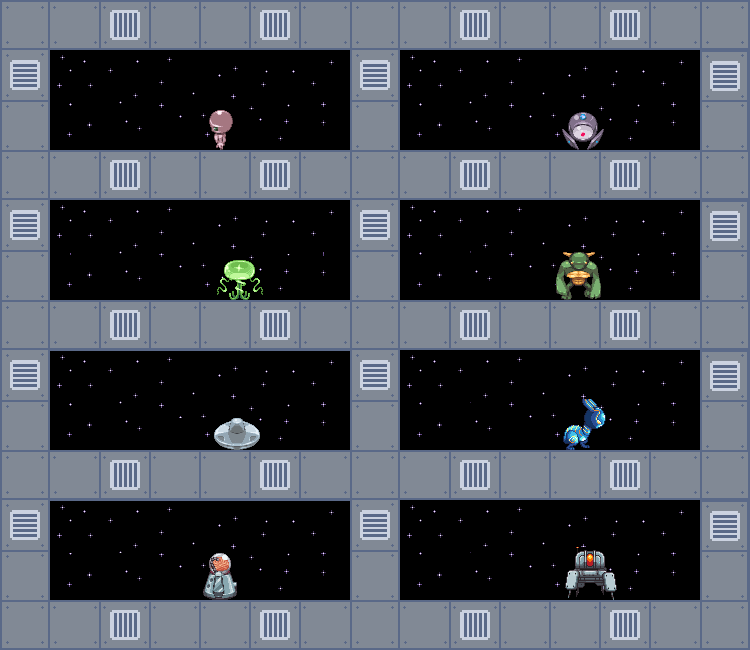

### Prison

This environment is part of the [gamma environments](../gamma.md). Please read that page first for general information. 

| Actions | Agents | Manual Control | Action Shape | Action Values | Observation Shape    | Observation Values     | Num States |
|---------|--------|----------------|--------------|---------------|----------------------|------------------------|------------|
| Either  | 8      | Yes            | (1,)         | [0, 2]        | (100, 300, 3) or (1,)| (0, 255) or (-300, 300)| ?          |

`from pettingzoo.gamma import prison_v0`

`agents= ["prisoner_0", "prisoner_1", ..., "prisoner_7"]`



*AEC diagram*

In prison, 8 aliens locked in identical prison cells are controlled by the user. They cannot communicate with each other in any way, and can only pace in their cell. Every time they touch one end of the cell and then the other, they get a reward of 1. Due to the fully independent nature of these agents and the simplicity of the task, this is an environment primarily intended for debugging purposes- it's multiple individual purely single agent tasks. To make this debugging tool as compatible with as many methods as possible, it can accept both discrete and continuous actions and the observation can be automatically turned into a number representing position of the alien from the left of it's cell instead of the normal graphical output.

Manual Control:

Select different aliens with 'W', 'A', 'S' or 'D'. Move the selected alien left with 'J' and right with 'K'.

Arguments:

```
prison.env(graphical_output=True, discrete_input=True, synchronized_start=False,
identical_aliens=False, max_frames=900, random_aliens=False)
```

*about arguments*

```
graphics_output: If set to True an image of the prisoner's cell is observed. If set to False, the distance to the left side wall is returned.

discrete_input: If True, each agent action is a discrete value indicating whether to move left or right one unit. If False, each agent action represents a real value that is added to the agent's x position

synchronized_start: If set to true, all aliens will start in the same x position, relative to their cells. Otherwise, their position is random.

identical_aliens: If set to true, each alien will have the some randomly chosen sprite. This argument overrides the random_aliens argument.

random_aliens: If set to True, each alien's sprite is randomly chosen from all possible sprites. If random_aliens and synchronized_aliens are both False, each alien's sprite is chosen cyclically from all possible sprites.
```

Discrete Leaderboard:

| Average Total Reward | Method | Institution | Paper | Code |
|----------------------|--------|-------------|-------|------|
| x                    | x      | x           | x     | x    |

Continuous Leaderboard:

| Average Total Reward | Method | Institution | Paper | Code |
|----------------------|--------|-------------|-------|------|
| x                    | x      | x           | x     | x    |
