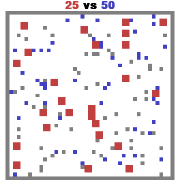

### Adversarial Pursuit

This environment is part of the [MAgent environments](../magent). Please read that page first for general information.




`pettingzoo.magent import adversarial_pursuit_v0`

`agents= [ predator_[0-24], prey_[0-49] ]`



*AEC diagram*

The red agents must navigate the obstacles and try to trap the blue agents.

Predator action options:

* doing nothing
* Moving to any of the 4 closest squares
* attacking any of the 8 closest squares.

Predator's reward is given as:

* -0.2 reward for attacking (shaped)
* 1 reward for attacking a prey

Prey action options:

* doing nothing
* moving to any of the 8 nearest squares

Prey's reward is given as:

* -1 reward for being attacked

```
adversarial_pursuit_v0.env(seed=None, shape_reward=True)
```

```
seed: seed for random values. Set to None to use machine random source. Set to fixed value for deterministic behavior.

shape_reward: Set to False to remove all shaped reward (as shown in the lists above). This should be set when evaluating your agent.
```
