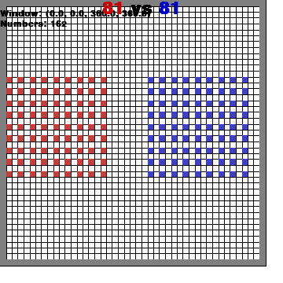

### Battle

This environment is part of the [MAgent environments](../magent.md). Please read that page first for general information.

| Actions  | Agents | Manual Control | Action Shape    | Action Values           | Observation Shape        | Observation Values |
|----------|--------|----------------|-----------------|-------------------------|--------------------------|--------------------|
| Discrete | 162    | No             | (21)         | Discrete(21)     | (13,13,41)             | [0,2]              |

`pettingzoo.magent import battle_v0`

`agents= [ red_[0-80], blue_[0-80] ]`



*AEC diagram*

A large-scale team battle.

Like all MAgent environments, agents can either move or attack each turn. An attack against another agent on their own team will not be registered.

Action options:

* doing nothing
* moving to any of the 12 closest squares
* attacking any of the 8 closest squares.

Reward is given as:

* -0.005 reward every step
* -0.1 reward for attacking
* 0.2 reward for attacking an opponent
* 5 reward for killing an opponent
* -0.1 reward for dying

If multiple options apply, the rewards are simply added together (so for example, attacking an opponent that does not die will give 0.095 reward)

```
battle_v0.env(seed=None)
```

```
seed: seed for random values. Set to None to use machine random source. Set to fixed value for deterministic behavior.
```
