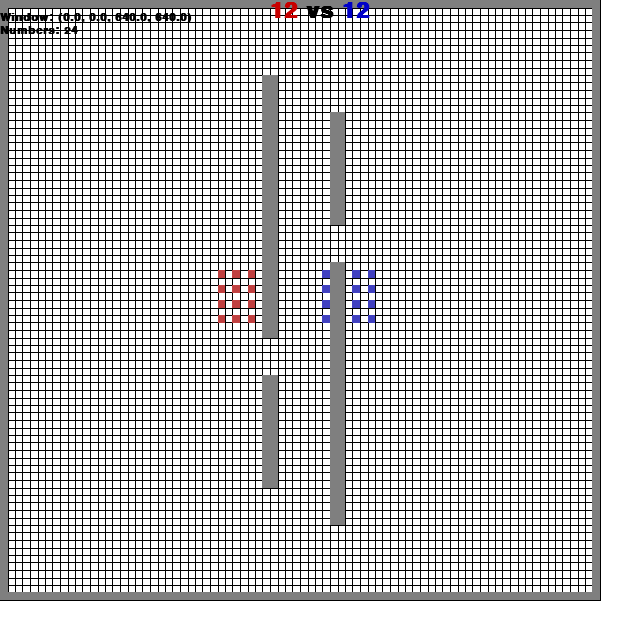

### Battlefield

This environment is part of the [MAgent environments](../magent). Please read that page first for general information.




`pettingzoo.magent import battlefield_v0`

`agents= [red_[0-11], blue_[0-11]]`



*AEC diagram*

Same as [battle](./battle) but with fewer agents arrayed in a larger space with obstacles.

A small-scale team battle. Agents have to figure out the optimal way to coordinate their small team in a large space and maneuver around obstacles in order to defeat the opponent team.

Like all MAgent environments, agents can either move or attack each turn. An attack against another agent on their own team will not be registered.

Action options: `[do_nothing, move_12, attack_8]`

Reward is given as:

* 5 reward for killing an opponent
* -0.005 reward every step (step_reward option)
* -0.1 reward for attacking (attack_penalty option)
* 0.2 reward for attacking an opponent (attack_opponent_reward option)
* -0.1 reward for dying (dead_penalty option)

If multiple options apply, rewards are added together.

Observation space: `[empty, obstacle, red, blue, minimap_red, minimap_blue, binary_agent_id(10), one_hot_action, last_reward, agent_position]`

Map size: 80x80

```
battle_v0.env(seed=None, step_reward-0.005, dead_penalty=-0.1, attack_penalty=-0.1, attack_opponent_reward=0.2)
```

```
seed: seed for random values. Set to None to use machine random source. Set to fixed value for deterministic behavior.

step_reward: reward added unconditionally

dead_penalty: reward added when killed

attack_penalty: reward added for attacking

attack_opponent_reward: Reward added for attacking an opponent
```
