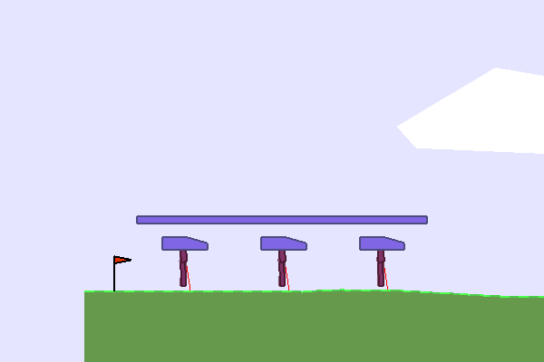

### Waterworld

This environment is part of the [SISL environments](../sisl.md). Please read that page first for general information.

| Observations      | Actions | Agents  | Manual Control | Action Shape | Action Values |  Num States |
|-------------------|---------|---------|----------------|--------------|---------------|-------------|
| Vector (viewable) | Either  | 5 (+/-) | No             | (2,)         | (-1, 1)       |  ?          |


`from pettingzoo.sisl import waterworld_v0`

`agents= ["pursuer_0", "pursuer_1", ..., "pursuer_4"]`



*AEC diagram*

By default there are 5 agents (purple), 5 food targets (green) and 10 poison targets (red). Each agent has 30 range-limited sensors, depicted by the black lines, to detect neighboring agents, food and poison targets, resulting in 212 long vector of computed values about the environment for the observation space. They have a continuous action space represented as a 2 element vector, which corresponds to left/right and up/down thrust. The agents each receive a reward of 10 when more than one agent captures food together (the food is not destroyed), a shaping reward of 0.01 for touching food, a reward of -1 for touching poison, and a small negative reward when two agents collide based on the force of the collision. The enviroment runs for 500 frames by default. Observation shape takes the full form of ((4 + 3*speed_features)*n_sensors+2,).

```
waterworld.env(n_pursuers=5, n_evaders=5, n_coop=2, n_poison=10, radius=0.015,
obstacle_radius=0.2, obstacle_loc=np.array([0.5, 0.5]), ev_speed=0.01,
poison_speed=0.01, n_sensors=30, sensor_range=0.2, action_scale=0.01,
poison_reward=-1., food_reward=10., encounter_reward=.01, control_penalty=-.5,
reward_mech='local', speed_features=True, max_frames=500)
```

*about arguments*

```
n_pursuers: number of pursuing archea

n_evaders: number of evaders

n_coop: how many archea touching food at same time for food to be considered consumed

n_poison: number of poison objects

radius: pursuer archea radius

obstacle_radius: radius of obstacle object

obstacle_loc: coordinate of obstacle object

ev_speed: evading archea speed

poison_speed: speed of poison object

n_sensors: number of sensor dendrites on all archea

sensor_range: length of sensor dendrite on all archea

action_scale: scaling factor applied to all input actions

poison_reward: reward for pursuer consuming a poison object

food_reward: reward for pursuers consuming an evading archea

encounter_reward: reward for a pursuer colliding with another archea

control_penalty: reward added to pursuer in each step

reward_mech: controls whether all pursuers are rewarded equally or individually

speed_features: toggles whether archea sensors detect speed of other objects

max_frames: after max_frames steps all agents will return done

```

Leaderboard:

| Average Total Reward | Method | Institution | Paper | Code |
|----------------------|--------|-------------|-------|------|
| x                    | PPO    | UMD         |       |      |

Add Gupta et al and DDPG paper results too
